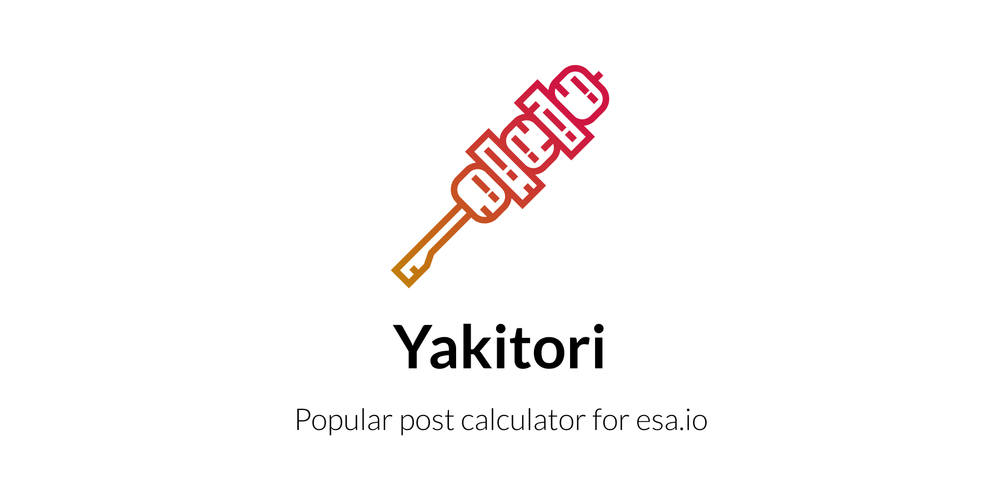

esaのホッテントリを計算してRedisに保存するツールです。HerokuのSchedulerとHeroku Redisを使って動かすことを想定しています。

## :warning: Herokuの無料枠が終了します :warning:

HerokuおよびHeroku Redisの無料枠は終了されます。

https://blog.heroku.com/next-chapter

YakitoriをHerokuでホスティングする（している）場合はご注意ください。

## License
[MIT](LICENSE)

## Note
Icon made by Freepik from [www.flaticon.com](https://www.flaticon.com)
